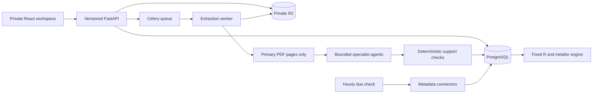

# Architecture and execution contracts

React/TypeScript serves a private workspace through the FastAPI application.
PostgreSQL stores scientific payloads, memberships, jobs, checkpoints, publication
state and cost reservations. Celery runs bounded extraction tasks through a
Redis-compatible queue. R2 contains private immutable source and evidence objects.
Local SQLite and filesystem storage are explicitly development alternatives.

## Bounded specialist workflow

The coordinator performs screening against the registered protocol. The text/table
specialist processes one source page at a time. The figure specialist proposes
panels, printed ticks, markers and spatial calibration; deterministic routines
calculate values and verification overlays. Normalization converts compatible
dimensions while preserving originals. The verifier reviews the same page;
discrepancy resolution can reject or flag values but cannot invent replacements.

Agents have no web, shell, file or benchmark tools. Each SDK run is limited to one
turn, output tokens and request timeout, with retries and sensitive tracing disabled.
Only source pages, protocol instructions and current-page extraction candidates enter
model context. Models cannot retrieve the private manual benchmark through the
worker. Model agreement is not independent scientific adjudication.

Page/phase checkpoints include source hash, protocol hash and prompt version.
The worker saves checkpoints and generated artifacts privately, resumes completed
phases, records source-specific coverage and persists an immutable extraction snapshot.
Run states distinguish completion, completion with abstentions, budget exhaustion,
cancellation and failure. Scientific decisions and membership changes create audit events.

## Scientific hierarchy

Publication records preserve identifiers, versions, status notices and source metadata.
Study families group DOI identity and explicit preprint/journal relationships.
Experiments preserve source sample labels. Each sample condition exposes named
attributes and linked measurement IDs through the condition contract. Measurement
records preserve raw values, bounds, units, basis, statistic, method, time, uncertainty,
independent/technical sample information and evidence locations. Conditions are a
typed view of experiment attributes; repeated measurement times remain separate fields.

The source remains eligible even when measurements cannot support inferential pooling.
Retractions and concerns quarantine affected evidence; corrections invalidate its
current use. Inactive evidence is excluded even if a historical measurement was accepted.

## API surfaces

All project reads require membership. Owner-only operations create projects, start
paid runs, trigger discovery, invite collaborators and import benchmark references.
Editors upload and review evidence, edit protocols and request supported synthesis.
Readers view evidence and exports. Mutations check same-origin browser requests;
sessions are server-side, hashed, expiring and secure over production HTTPS.

OpenAPI covers `/api/v1/projects`, protocols, documents, runs, experiments,
conditions, study families, measurements, publications, analyses and benchmarks.
Private object endpoints enforce project prefixes and membership. `contracts.py`
defines response schemas, and `scripts/schema_contracts.py` exports them reproducibly.

## Limits that affect scientific claims

Graph support is limited to calibrated Cartesian geometry and explicit spatial
scales. Unsupported plots abstain. Figure and microscopy outputs require semantic
adjudication. Independent n, SD, density, mass/volume bases and comparator identity
are never filled from assumptions. A pinned statistical engine can be unavailable;
that is an analysis limitation, not a license to substitute a different estimator.

Discovery completeness is provider-specific and bounded. Partial checks and pending
evidence keep the synthesis stale. Software tests exercise synthetic reference cases;
real extraction performance remains a separate primary-source evaluation.
